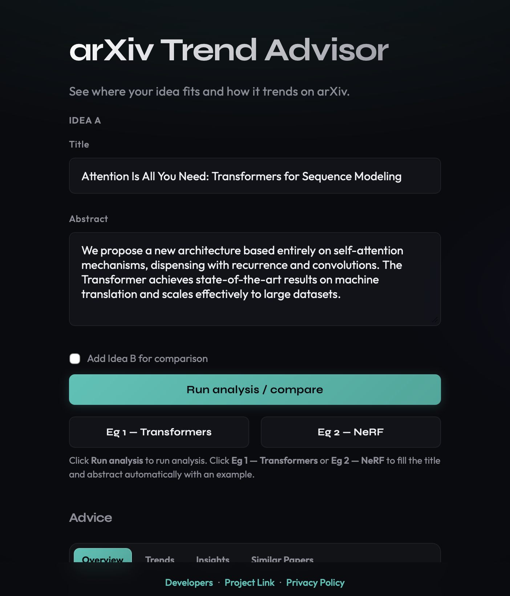
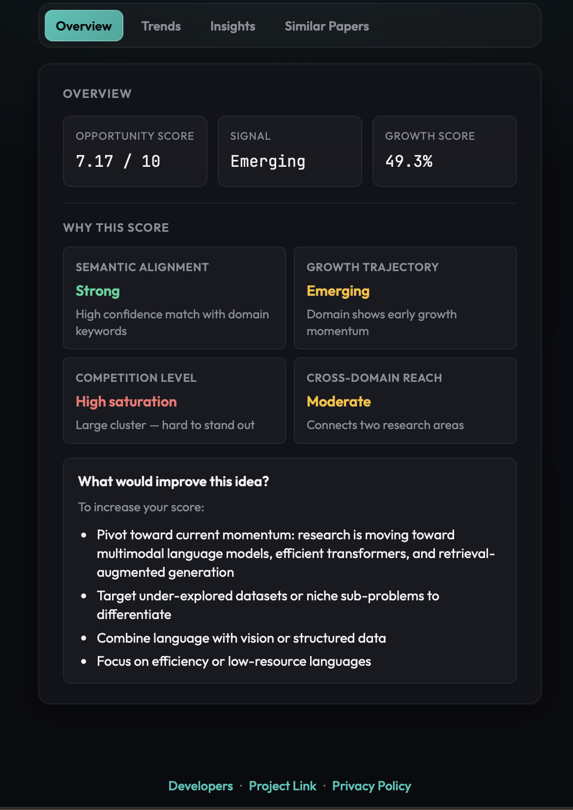
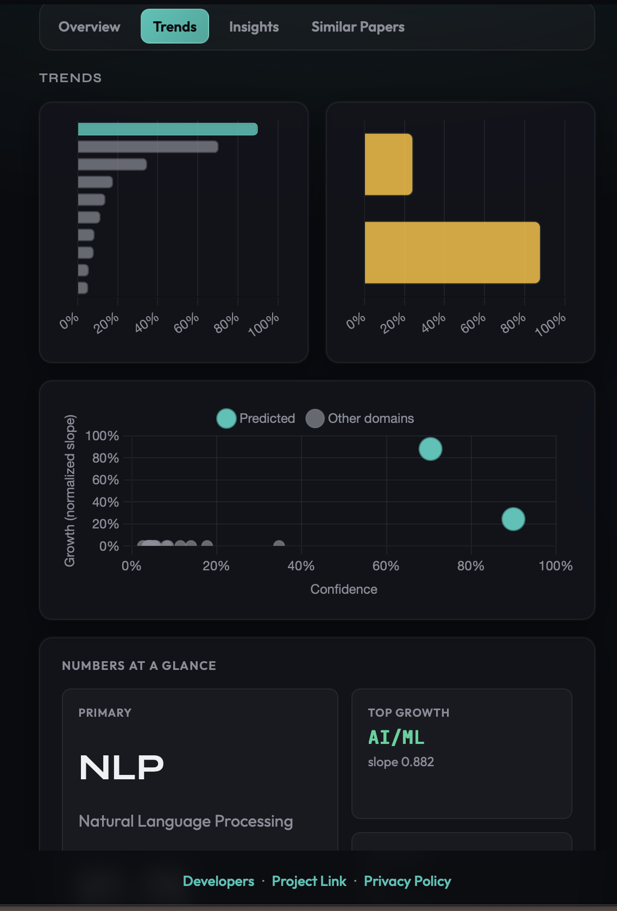
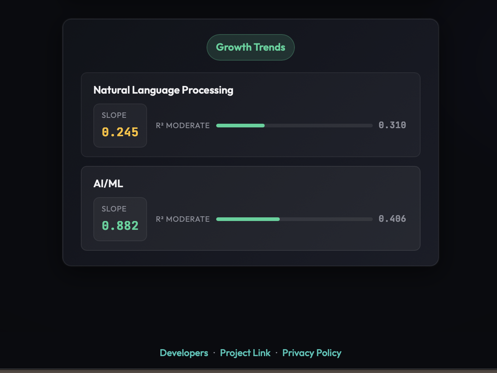
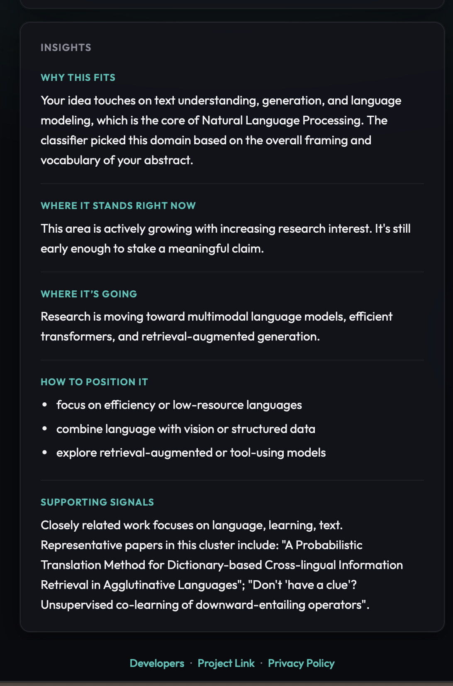
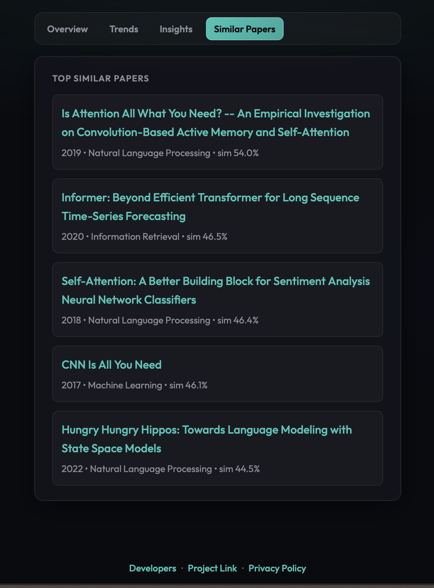

# Eidon AI

AI-powered research intelligence platform for analyzing arXiv trends, mapping idea-to-domain alignment, and positioning research ideas within evolving scientific landscapes.

Built on ~36K arXiv research papers across AI, ML, NLP, systems, and interdisciplinary computer science domains.

---

Research discovery is increasingly fragmented across rapidly evolving domains. Eidon AI explores how machine learning and research intelligence workflows can help researchers understand emerging areas, interdisciplinary overlap, and idea positioning earlier in the research lifecycle.

---

## Platforms

- 🌐 Web App — interactive interface for idea analysis  
- 📱 Mobile App — on-the-go research insights  
- ⚡ API — FastAPI backend serving predictions  

## What Eidon Does

Eidon takes a raw research idea (title + abstract input) and:

- identifies aligned research domains
- analyzes trend momentum and domain growth
- finds semantically related research papers
- detects interdisciplinary overlap between domains
- evaluates idea positioning relative to existing literature
- surfaces insights through deployed web/mobile interfaces

Instead of only searching papers, the system places a research idea into the larger research ecosystem and analyzes where it fits, how it overlaps, and how related areas are evolving over time.

---

## Preview

### Main Interface

### Results & Predictions

### Trends / Analysis

### Dashboard

### Insights View

### Similar Papers / Insights

---

## Core Capabilities

- Research trend detection using arXiv publication data
- NLP-based domain classification
- Idea-to-domain alignment analysis
- Similar paper and overlap detection
- Trend trajectory and momentum scoring
- Research positioning and keyword insight generation

---

## Dataset & Research Pipeline

- Collected and processed ~36K arXiv research papers using the official arXiv API
- Extracted titles, abstracts, authors, categories, publication dates, and metadata
- Structured research data into CSV/JSON pipelines for downstream analysis
- Performed exploratory trend analysis and semantic clustering across domains

---

## Modeling Approach

Used TF-IDF vectorization with linear machine learning models for high-dimensional sparse text representations common in research abstracts.

Linear models were selected for:
- interpretability
- fast inference
- scalability
- efficient handling of sparse NLP vectors
- strong performance on multi-domain text classification tasks

The system combines:
- NLP preprocessing
- TF-IDF vectorization
- domain classification
- trend scoring
- semantic similarity analysis
- research growth modeling

---

## System Architecture

The platform follows a modular multi-layer architecture separating research ingestion, model serving, backend APIs, and client-facing interfaces.

### Architecture Layers

- `research_pipeline/` → data ingestion, preprocessing, EDA, model training
- `backend/` → FastAPI prediction-serving APIs
- `web_app/` → browser-based interface
- `mobile_app/` → Flutter mobile client
- `tests/` → validation and API testing workflows

---

## Tech Stack

- Python
- FastAPI
- Scikit-learn
- NLP / TF-IDF
- Pandas
- NumPy
- React
- Flutter
- REST APIs
- Render Deployment

---

## Deployment

### Live Platforms

- Web App: https://eidon-web-001.onrender.com
- API: https://eidon-api-001.onrender.com
- API Docs: https://eidon-api-001.onrender.com/docs

---

## API Features

### Health Endpoints
- `/health`
- `/health/live`
- `/health/ready`

### Advisor Endpoints
- `/api/v1/advisor/advise`
- `/api/v1/advisor/compare`
- `/api/v1/advisor/stats`

The backend serves prediction workflows, trend analysis, comparison logic, and research insight generation through FastAPI endpoints.

---

## Example Workflow

### Input
Title:
`Attention Is All You Need: Transformers for Sequence Modeling`

Abstract:
Research abstract submitted through the advisor interface.

### System Output
- Predicted research domain
- Confidence score
- Growth trajectory analysis
- Similar paper recommendations
- Trend momentum insights
- Cross-domain overlap signals

---

## Exploratory Data Analysis (EDA)

Performed large-scale exploratory analysis on arXiv computer science domains to study:

- publication growth trends
- interdisciplinary movement
- semantic clustering
- domain saturation
- emerging research directions

Analysis included:
- t-SNE semantic clustering visualizations
- domain growth trajectory analysis
- interdisciplinarity scoring
- publication distribution tracking
- trend forecasting workflows

---

## Frontend Features

- Interactive idea analysis dashboard
- Trend visualization panels
- Research comparison workflows
- Similar paper exploration
- Domain growth insights
- Cross-platform web/mobile experience

---

## My Contribution

- Designed and developed components of the research pipeline and trend analysis workflows
- Built backend integrations and FastAPI-based prediction-serving functionality
- Contributed to architecture design, API workflows, testing, and deployment coordination
- Helped develop and refine web/mobile interface experiences
- Worked on research-domain classification, idea-positioning logic, and product framing

---

## Team

Built collaboratively by:

- Jayashree Johnson
- Kethan Dosapati
- Kamal Domanadula

---

## Research Direction

Future directions include:
- transformer-based semantic embeddings
- citation-network analysis
- real-time research monitoring
- adaptive recommendation systems
- deeper interdisciplinary trend forecasting
- large-scale research intelligence workflows

---

## Want full details and project flow?

Use README_FULL_FLOW.md for full implementation and updated pipeline steps.

## License

MIT License
